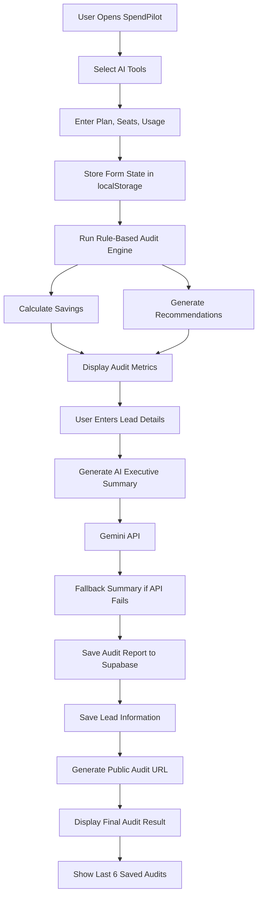

# ARCHITECTURE.md

## System Overview

SpendPilot is a lightweight AI spend auditing web application built to help developers, startup teams, and small companies identify unnecessary spending on AI subscriptions and optimize their monthly software costs.

The application follows a frontend-first architecture where the audit calculations are performed using deterministic rule-based logic on the client side, while Supabase is used for persistent storage of audit reports and lead information. Gemini API is used only for generating personalized executive summaries after the financial calculations are completed.

The project was intentionally designed as a fast-moving MVP focused on validating the audit workflow and user experience before investing in heavier backend infrastructure.

---

## System Architecture Diagram

---

## Data Flow
The basic idea of the data flow is that, the user will land on the homepage where there are 6 tools as of now (ChatGPT, Claude, Gemini, Cursor, GitHub Copilot and WindSurf) from which the user can select one or more tool and upon selection the tool will expand and allow the user to enter details like which plan they are currently using, what is the seat count and how frequently they use that tool and all the data entered by the user is stored in the localStorage so it gets saved even if you reload the page after taking the user input the app logic will come into action and check if the user is spending more than expected, if the current usage frequency justifies what plan they purchased based on that either they should downgrade or upgrade their subscription. I have kept the audit engine rule based rather than AI generated as we are giving financial recommendations so they need to be properly understood by the user and explainable. After calculations the app will then provide the user with Total Monthly Spend, Optimized Spend, Estimated Savings, Annual Savings a short recommendation message for each tool, total monthly vs annual comparison. Then it will also provide the user with an summary which is done by AI by passing the audit results into Gemini API to generate an AI executive summary, i have kept the AI layer different from the calculations as it is only responsible for generation of the business specific summaries, now if incase Gemini API fails to return any response a fallback summary generator comes into action to generate a concise summary so that there is no blockage of user experience.  After the data is generated the audit results gets stored in the audit_reports table and the user data gets stored in the leads table. I chose supabase because of easy implementation of database storage as each saved audit receives a unique ID based public URL the public report allows users to revisit and share audit summaries without requiring authentication.

---

## Tech Stack Decisions

| Technology   |   Reason for Choosing                                                             |
|--------------|-----------------------------------------------------------------------------------|
| React + Vite | To ensure fast development and lightweight setup compared to Next.js              |
| TailwindCSS  | I have worked with it majorly during my whole academic journey so i am confident  |
| Supabase     | Faster backend setup compared to Node.js as there is a time constraint            |
| Gemini API   | Free accessibility compated to OpenAI and Anthropic                               |
| Vitest       | Lightweight testing setup compatible with Vite                                    |
| Vercel       | Simple deployment and have worked with it before so i am familiar with it         |
| localStorage | Simple persistence for form state without requiring authentication                |

---

## Why I Chose React + Vite Instead of Next.js

Initially, I considered developing the project using Next.js and Node.js but then dur to time constraint i shifted to React + Vite as i have learned React recently and i have hands on experience and the the application did not require server side complex routing  so using Next.js would have made the project very complex for me to develop.

---

## Why the Audit Engine is Rule-Based Instead of AI-Based

One decision which i feel is important was keeping the audit calculations fixed as using AI for financial recommendations would make the output feel very inconsistent, hard to explain and testing would have been very hard compared to now. So instead i used AI only  for executive summaries after the calculations are already completed.

---

## Current Limitations

Due to time constraints, several production-level features were intentionally not implemented:
- transactional email delivery
- abuse protection / captcha
- Open Graph preview generation
- advanced analytics instrumentation
- server-side caching

My main focus was on building a complete audit workflow first before expanding infrastructure complexity.

---

## Scaling Considerations for 10k Audits/Day

If SpendPilot needed to handle 10k audits a day the improvements i would make to the current version would be queue the AI summary generation, to improve database efficiency archive the older reports as now there are many duplicate values present also maybe implemented indexing in the report section, enhance AI summary generation by changing the current model to a potentially higher rate paid model to improve performance.

---

## Security Considerations

The project uses environment variables for Supabase and Gemini API keys and avoids committing secrets into the repository. Public audit URLs are designed to exclude sensitive lead information such as email addresses and company data.