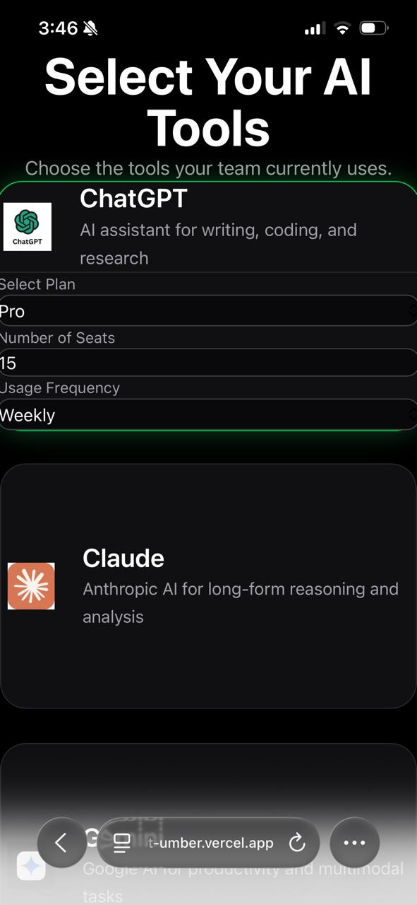
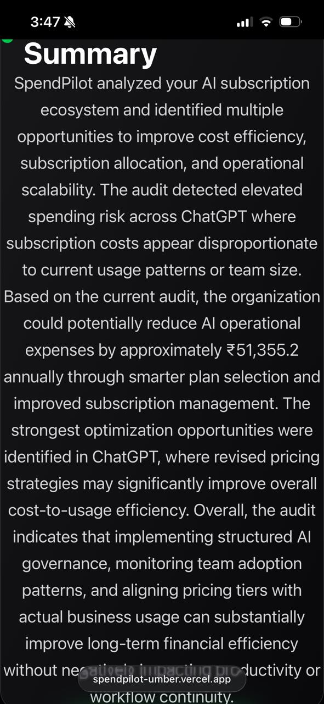
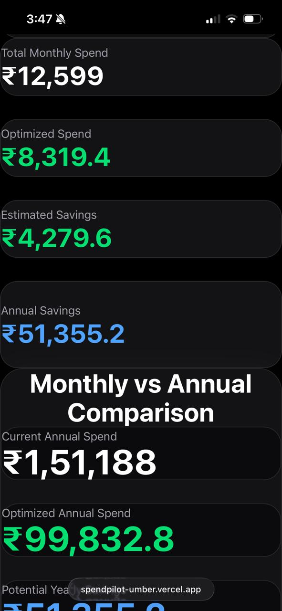
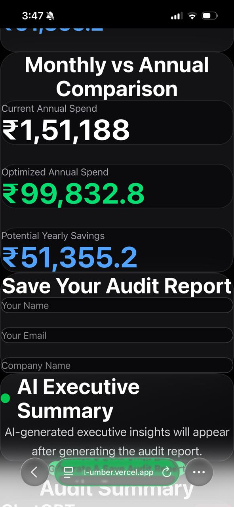
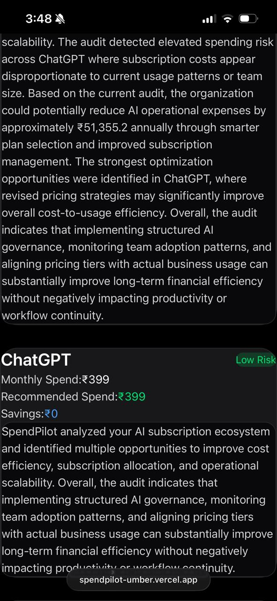

# SpendPilot 

SpendPilot is an AI powered SaaS audit dashboard that helps individuals and teams analyze their AI subscription spending, identify optimization opportunities, and generate executive level cost saving insights using LLM generated summaries.

Built as part of an AI engineering internship assignment, the project combines frontend engineering, AI integration, cloud databases, testing, and deployment into a production-style MVP.

---

# Live Demo

Deployment:  
https://spendpilot-umber.vercel.app/

GitHub Repository:  
https://github.com/anii-k05/spendpilot

Demo Video:
https://youtube.com/shorts/J3KxdCQROGE?feature=share

---

---

# Screenshots

## Landing Page


## Tool Selection Dashboard



## AI Executive Summary



## Audit Data Overview



## Monthly vs Annual Comparison



## Saved Audit Reports



---

# Features

- AI tool subscription audit dashboard
- Real-world AI pricing plans in INR (₹)
- Dynamic spend calculations
- Monthly vs annual savings analysis
- Risk-level classification
- AI-generated executive summaries using Gemini API
- Supabase database integration
- Saved audit reports
- Lead capture system
- Responsive SaaS-style UI
- Automated CI/CD with GitHub Actions
- Unit testing with Vitest

---

# AI Integration

SpendPilot uses Google Gemini API to generate personalized executive summaries based on:
- selected AI tools
- pricing plans
- estimated savings
- usage frequency
- optimization opportunities

The app also includes:
- prompt engineering
- graceful fallback handling
- rule-based backup summaries if API calls fail

---

# Tech Stack

## Frontend
- React
- Vite
- Tailwind CSS

## Backend / Database
- Supabase

## AI
- Google Gemini API

## Testing
- Vitest

## Deployment
- Vercel

## CI/CD
- GitHub Actions

---

# Core Functionalities

## AI Tool Auditing
Users can:
- select AI tools
- choose real subscription plans
- enter seat count
- define usage frequency

The system then calculates:
- total spend
- optimized spend
- estimated savings
- annual savings
- risk level

---

## AI Executive Summary
The application generates business-oriented executive summaries dynamically using Gemini AI based on the audit data.

If the AI request fails, the system automatically falls back to a rule-based summary generator.

---

# Testing

The project includes unit tests for:
- savings calculations
- recommendation generation
- audit engine behavior

Tests were implemented using Vitest.

Run tests using:

```bash
npm test
```

--- 

# Local Setup

Clone the repository:

```bash
git clone https://github.com/anii-k05/spendpilot.git
```

Install dependencies:

```bash
npm install
```

Create `.env` file:

```env
VITE_GEMINI_API_KEY=your_api_key
VITE_SUPABASE_URL=your_supabase_url
VITE_SUPABASE_PUBLISHABLE_KEY=your_publishable_key
```

Run locally:

```bash
npm run dev
```

---

# Decisions & Trade-offs

## 1. Rule-Based Calculations Instead of AI Financial Decisions

I intentionally kept the audit calculations deterministic and rule-based instead of allowing the LLM to generate pricing recommendations directly. I made this decision because financial calculations need predictable and explainable outputs, while LLM generated calculations could become inconsistent or hallucinate incorrect recommendations.

## 2. Real Pricing Plans Instead of Manual Spend Inputs

Initially the dashboard allowed users to manually enter any monthly spend amount, but later I switched to real subscription plan selection using actual pricing references. This required more implementation effort, but it made the product feel significantly more realistic and improved the quality of the generated audit insights.

## 3. Gemini AI Only For Summaries

I decided to use Gemini AI only for generating executive summaries instead of using AI throughout the entire audit flow. This helped reduce unnecessary API dependency while still adding value where natural language generation was actually useful.

## 4. Fallback Summary Generator For Reliability

I added a fallback summary generator so the application continues working even if the Gemini API fails due to limits, downtime, or network issues. The trade-off was slightly more implementation complexity, but it improved reliability and prevented broken user experiences.


## 5. Focus On MVP Simplicity Instead Of Full SaaS Features

I intentionally avoided adding authentication, team workspaces, or complex analytics dashboards in the current version. Instead, I focused on building a functional MVP with strong core functionality, cleaner UI, real pricing workflows, and reliable audit generation within the assignment timeline.

---

# Future Improvements
- Graph visualizations
- Multi-user authentication
- Export reports as PDF
- Advanced AI recommendation engine
- Enterprise SaaS benchmarking
- Historical analytics dashboard

---

# Author 

Anirudhh Kansara
